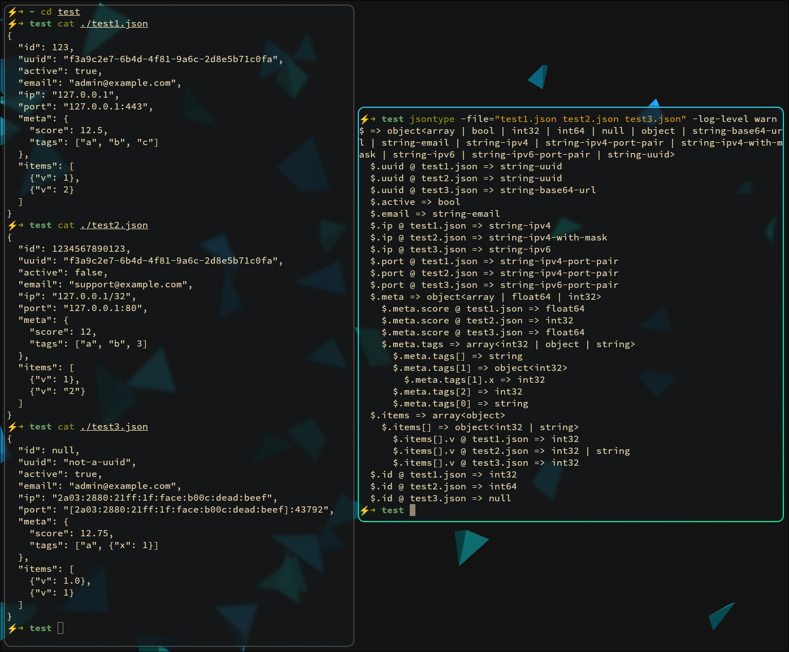

# JSONType

JSONType is a CLI tool that analyzes one or more JSON files, infers their data types and structure, merges nested objects and arrays, and produces a clear, searchable description of the resulting JSON schema and type layout.

It is designed for exploration, debugging, reverse‑engineering unknown JSON, and documenting real‑world data formats that don't come with schemas.



## Installation

```sh
go install github.com/4nd3r5on/jsontype/cmd/jsontype@latest
```

The binary will be installed as `jsontype` in your `$GOBIN`.

## Basic Usage

### Analyze a single file

```sh
jsontype ./parseme.json
jsontype parseme.json
```

### Pipe input from stdin

```sh
cat file.json | jsontype
curl https://api.example.com/data | jsontype
```

### Analyze multiple files

Multiple files can be provided as arguments and will be merged into a single inferred structure:

```sh
jsontype parseme1.json parseme2.json parseme3.json
jsontype "parse me.json" parseme1.json parseme2.json
```

### Control output and logging

```sh
# Enable verbose diagnostics
jsontype -log-level debug parseme.json

# Write output to a file
jsontype -out schema.txt parseme.json
```

## CLI Flags

```
-ignore-objects string
    Space-separated JSON paths to ignore
    Example: 'metadata debug.info'

-parse-objects string
    Space-separated JSON paths to explicitly parse
    Example: 'users data.items'

-max-depth int
    Maximum depth to parse (0 = unlimited)

-no-string-analysis
    Disable extended string type detection (UUID, email, IP addresses, etc.)

-log-level string
    debug | info | warn | error (default: "info")

-out string
    Output file (default: stdout)
```

## Type Detection

### Basic Types

JSONType detects the following basic JSON types:

- `unknown` - Unable to determine type
- `null` - JSON null value (or possibly missing)
- `string` - Text string
- `bool` - Boolean (true/false)
- `int32` - 32-bit integer
- `int64` - 64-bit integer
- `float64` - Floating point number

### Container Types

- `object` - JSON object with string keys
- `object_int` - Object with integer keys (map-like structures)
- `array` - JSON array

### Extended String Types

By default, JSONType performs analysis of string values to detect common patterns. This can be disabled with the `-no-string-analysis` flag.
String type detection is heuristic-based and may not be 100% accurate for all edge cases.

#### Common Formats

- `string-uuid` - UUID identifiers  
  Example: `f3a9c2e7-6b4d-4f81-9a6c-2d8e5b71c0fa`
  
- `string-filepath-windows` - Windows file paths  
  Example: `C:/user/documents/file.txt`
  
- `string-email` - Email addresses  
  Example: `admin@email.com`
  
- `string-phone` - Phone numbers  
  Example: `+380661153394`

#### Web and Networking

- `string-link` - URLs and web links  
  Example: `https://google.com` or `google.com/search`
  
- `string-domain` - Domain names  
  Example: `google.com`
  
- `string-ipv4` - IPv4 addresses  
  Example: `127.0.0.1`
  
- `string-ipv4-with-mask` - IPv4 with CIDR notation  
  Example: `127.0.0.1/32`
  
- `string-ipv6` - IPv6 addresses  
  Example: `2a03:2880:21ff:001f:face:b00c:dead:beef`
  
- `string-ipv4-port-pair` - IPv4 address with port  
  Example: `127.0.0.1:443`
  
- `string-ipv6-port-pair` - IPv6 address with port  
  Example: `[2a03:2880:21ff:1f:face:b00c:dead:beef]:43792`
  
- `string-mac` - MAC addresses  
  Example: `9e:3b:74:a1:5f:c2`

#### Encoding Formats

- `string-hex` - Hexadecimal strings  
  Example: `a9f3c2e7b4d81f6a`
  
- `string-b64-std` - Base64 standard encoded data  
  Example: `wqFIb2xhL+S4lueVjCtHbyE=`

- `string-b64-url` - Base64 URL encoded data  
  Example: `wqFIb2xhL-S4lueVjCtHbyE=`

- `string-b64-raw-std` - Base64 raw standard encoded data  
  Example: `wqFIb2xhL+S4lueVjCtHbyE`

- `string-b64-raw-url` - Base64 raw URL encoded data  
  Example: `wqFIb2xhL-S4lueVjCtHbyE`

## JSON Path Format

JSONType uses a simple, readable JSON path syntax to refer to specific locations in a document.

### Basic form

```
$.obj1.obj2.array[0].name
```

- `.` separates object keys
- `[0]` refers to a specific array index

### Wildcards

```
$.obj1.obj2.array[].id
```

`[]` means **any element** of:

- an array, or
- an object with integer keys

This is especially useful for describing homogeneous arrays or map-like objects.

### Root prefix

```
$
```

- `$.` is an optional root prefix
- Paths may be written with or without it

These are equivalent:

```
users[].id
$.users[].id
```

## Selective Parsing

NOTE: paths can be by coma, space, or tab. U can use quotes and also back slashes for escape characters

### Parse only specific subtrees

```sh
jsontype -parse-objects "users events.items" data.json
```

Only the listed paths will be analyzed; everything else is skipped.

### Ignore specific paths

```sh
jsontype -ignore-objects "metadata debug.info" data.json
```

Ignored paths are completely excluded from inference and merging.

### Limit parsing depth

```sh
jsontype -max-depth 5 data.json
```

Stops analyzing nested structures beyond the specified depth.

## Typical Use Cases

- **Reverse‑engineering undocumented APIs** - Discover the structure of API responses without documentation
- **Exploring logs or event streams** - Understand the shape of log data and event payloads
- **Debugging unexpected JSON shape changes** - Identify schema drift between versions
- **Creating documentation for real-world JSON formats** - Generate schema documentation from examples
- **Validating assumptions before writing parsers** - Verify data types before implementing deserialization
- **Analyzing network traffic** - Detect IP addresses, UUIDs, and other structured data in JSON payloads
